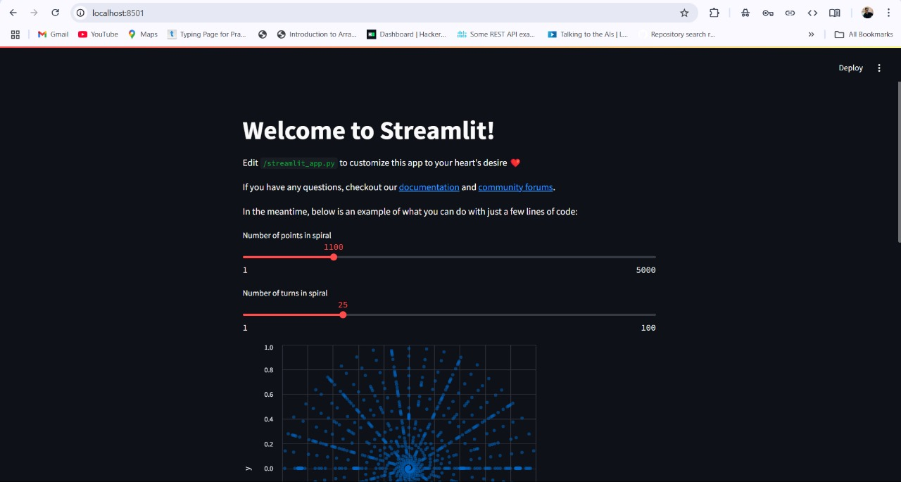

## EXP-1: *Streamlit Spiral Visualization App with Docker*

Welcome to the *Streamlit Spiral Visualization App*! This project demonstrates a simple and interactive Python application built with **Streamlit** to visualize a spiral. You can customize the spiral’s characteristics using adjustable sliders and view the changes in real-time. The app is Dockerized for easy deployment and consistency across environments.

## 🌟 *Features*
- *Interactive Controls*: Use sliders to adjust the number of points and turns in the spiral.
- *Dynamic Visualization*: Watch the spiral change dynamically in response to slider adjustments.
- *Dockerized Application*: The app is packaged within a Docker container, ensuring portability and easy deployment.

## 🚀 *Technologies Used*
- *Python 3*: The core programming language for this app.
- *Streamlit*: A framework for building interactive and beautiful web applications.
- *Altair*: A declarative statistical visualization library for Python used for rendering the spiral.
- *Docker*: Containerizes the app for consistent behavior across different environments.
- *Pandas*: Used for data manipulation and handling data frames.

## ⚙ *Prerequisites*
Before running the application, ensure you have the following installed on your local machine:

- *Docker*: To build and run the app inside a container.
- *Git*: To clone the repository.

If you don't have *Docker* installed, follow the instructions in the official [Docker Installation Guide](https://docs.docker.com/get-docker/).

## 🛠 **Getting Started**
Follow these steps to set up and run the application either locally or inside a Docker container:

### Step 1: **Clone the Repository**
Clone the repository to your local machine by running:

```bash
git clone https://github.com/Aditya5757raj/Docker_Practices

cd Docker_Practices
```

### Step 2: **Create a `requirements.txt` File**
Ensure the project directory includes a `requirements.txt` file containing the necessary dependencies:

```txt
streamlit
altair
pandas
```

### Step 3: **Build the Docker Image**
Build the Docker image from the project directory:

```bash
docker build -t streamlit .
```

This will use the `Dockerfile` to build the image named `streamlit`.

#### **Check If the Image is Built**
After building the image, you can check if it has been created by either:

- **Using Docker Desktop**: Go to the **Images** section to verify if the `streamlit` image is listed.
  
- **Using the Command Line**: Run the following command to list all Docker images:

  ```bash
  docker images
  ```

  This command will display all available images, including the `streamlit` image if it has been successfully built.

### Step 4: **Run the Docker Container**
Start the app inside a Docker container by running:

```bash
docker run -p 8501:8501 streamlit
```

This command will map port `8501` inside the container to port `8501` on your local machine.

### Step 5: **Access the Streamlit App**
After running the container, open your browser and go to:

```
http://localhost:8501
```

The Streamlit app should now be visible, allowing you to interactively adjust the spiral’s number of points and turns.

## 🌀 **How the App Works**

### **Sliders for Customization**
- **Number of points in spiral**: Controls the number of points that form the spiral.
- **Number of turns in spiral**: Adjusts how many full turns the spiral makes.

### **Real-Time Visualization**
As you adjust the sliders, the spiral is dynamically updated in real-time.

### **Under the Hood**
The app generates the spiral points based on polar coordinates. The `x` and `y` positions are calculated using mathematical functions, and the results are rendered using **Altair** charts in the Streamlit app.

## 🖼 **Results**
Here is an example of the Streamlit Spiral Visualization App in action:



## 💻 **Code Explanation**
- **NamedTuple for Points**: The spiral points are stored as `Point` objects (with `x` and `y` coordinates) using Python’s `namedtuple`.
  
- **Generating Spiral Data**: The total number of points and turns are used to calculate the spiral coordinates. The angle for each point is derived using the polar coordinate system.

- **Streamlit Visualization**: The data is passed to **Altair** for visualization, and the spiral is displayed as a scatter plot, with each point represented as a circle.

## 🛠 **Troubleshooting**
If you encounter any issues, here are a few tips:

1. **Check Docker Logs**: If the container fails to start, use the following command to check the logs:

   ```bash
   docker logs <container_id>
   ```

2. **Ensure Dependencies are Installed**: If there are errors related to missing packages, make sure the `requirements.txt` is correctly copied into the Docker image, and the `pip install` command runs successfully during the Docker build.

## 🤝 **Contributing**
We welcome contributions to improve this project! Here’s how you can contribute:

1. Fork the repository.
2. Create a new branch for your changes.
3. Make the necessary changes and commit them.
4. Push your changes to your forked repository.
5. Open a pull request to merge your changes into the main repository.

---

### Happy Coding! 🎉