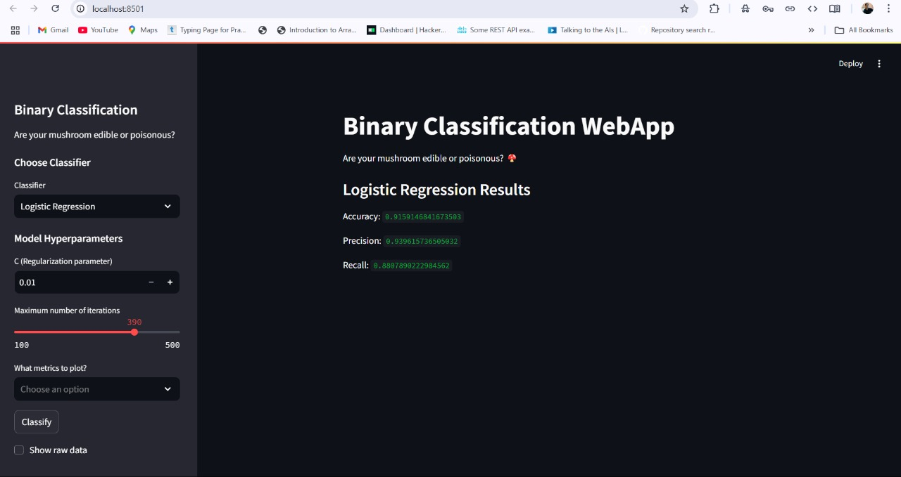

# Docker Experiment 2: Binary Classification WebApp with Streamlit

Welcome to **Docker Experiment 2**! This project demonstrates the power of **Docker** to containerize a **machine learning web application** built using **Streamlit**. The app classifies mushrooms as either **edible** or **poisonous** based on input features, utilizing machine learning classifiers.

---

## 🚀 Project Overview

This is a **Binary Classification WebApp** designed to predict whether a mushroom is edible or poisonous using machine learning models. The app offers a selection of classifiers, such as **Support Vector Machine (SVM)**, **Logistic Regression**, and **Random Forest**.

### Key Features:
- **Interactive UI** built with **Streamlit** for classification and visualization.
- **Multiple Classifiers**: Choose between **SVM**, **Logistic Regression**, and **Random Forest**.
- **Evaluation Metrics**: View **Confusion Matrix**, **ROC Curve**, and **Precision-Recall Curve**.
- **Dockerized App**: Easy deployment and isolated environment.

---

## 📝 Prerequisites

Before running the project, ensure you have the following installed:

- **Docker**: [Download and install Docker](https://www.docker.com/get-started)
- **Docker Compose**: For managing multi-container Docker applications.

---

## 📂 Project Structure

```plaintext
/Docker_Practices
├── /Exp-2
    ├── Dockerfile                 # Dockerfile to build the container image
    ├── docker-compose.yml         # Docker Compose configuration file
    ├── app.py                     # Streamlit app for mushroom classification
    ├── requirements.txt           # Python dependencies
    └── mushrooms.csv              # Mushroom dataset for classification
```

---

## 🚀 How to Run the Project

Follow the steps below to get the app up and running in your local environment.

### Step 1: Clone the Repository

Clone this repository to your local machine:

```bash
git clone https://github.com/Aditya5757raj/Docker_Practices.git
cd Docker_Practices/Exp-2
```

### Step 2: Build the Docker Image

To build the Docker image, run the following command:

```bash
docker-compose build
```

This command will read the Dockerfile and build the image for the container.

### Step 3: Run the Docker Container

Once the image is built, start the container using:

```bash
docker-compose up
```

Now, the app will be available at http://localhost:8501.

### Step 4: Interact with the App

Open your browser and go to http://localhost:8501.
- Select a classifier (SVM, Logistic Regression, or Random Forest) from the sidebar.
- Adjust the hyperparameters and metrics to visualize (Confusion Matrix, ROC Curve, Precision-Recall Curve).
- Click Classify to see the results and metrics.

### Step 5: Stop the Application

To stop the application and the Docker container:

```bash
docker-compose down
```

---

## 🖼️ Results

Here is a sample result from the classification output:



This image displays a confusion matrix, ROC curve, and a precision-recall curve for a classification task.

---

## 🤝 Contributing

Feel free to fork the repository and submit a pull request with your improvements! If you encounter any issues or have feature requests, please open an issue on GitHub.

---

### Happy Coding! 🎉