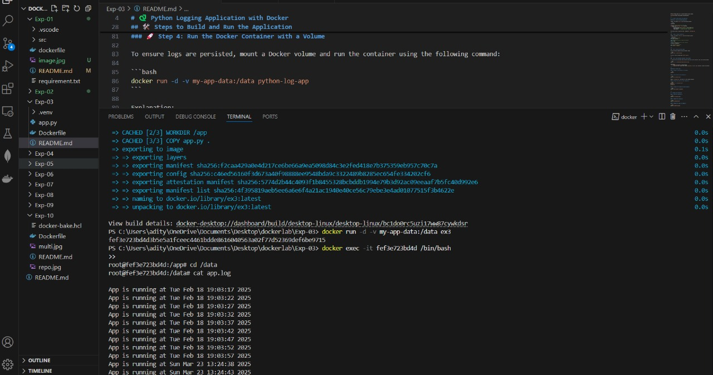
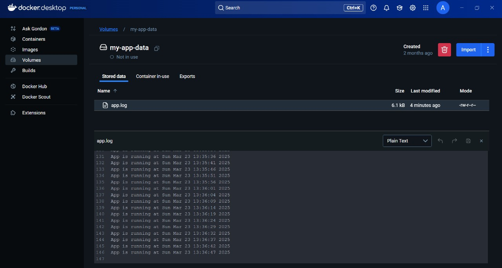

---

# 🐍 Python Logging Application with Docker

This project demonstrates how to create a Python application that logs data continuously to a file and runs it inside a Docker container. The logs are saved in a Docker volume, ensuring persistence even after the container is stopped or removed.

---

## 📁 Project Structure

```plaintext
.
├── app.py            # Python application that generates logs
└── Dockerfile        # Dockerfile to build the image
```

---

## 📥 Prerequisites

Before starting, make sure to install Docker on your system:

[Get Docker](https://docs.docker.com/get-docker/)

---

## 🛠️ Steps to Build and Run the Application

### 🐍 Step 1: Write the Python Application

Create a file named `app.py` with the following content:

```python
import time

# Create or open a log file to write data
with open("/data/app.log", "a") as log_file:
    while True:
        log_file.write(f"App is running at {time.ctime()}\n")
        log_file.flush()  # Ensure log is written immediately
        time.sleep(5)     # Log entry every 5 seconds
```

This script writes a log entry every 5 seconds to `/data/app.log`.

---

### 🛠️ Step 2: Create a Dockerfile

Create a file named `Dockerfile` with the following content:

```dockerfile
# Use a base Python image
FROM python:3.9-slim

# Set the working directory inside the container
WORKDIR /app

# Copy the application code into the container
COPY app.py /app/app.py

# Run the Python application
CMD ["python", "app.py"]
```

---

### 🚀 Step 3: Build the Docker Image

Run the following command to build the Docker image:

```bash
docker build -t python-log-app .
```

This will create an image named `python-log-app`.

---

### 🚀 Step 4: Run the Docker Container with a Volume

To ensure logs are persisted, mount a Docker volume and run the container using the following command:

```bash
docker run -d -v my-app-data:/data python-log-app
```

Explanation:
- `-d`: Runs the container in detached mode.
- `-v my-app-data:/data`: Mounts the volume `my-app-data` to the `/data` directory inside the container.

---

### 😨 Step 5: Verify Logs

#### 1. **Check if the container is running:**

```bash
docker ps
```

#### 2. **View logs from the container:**

```bash
docker logs <container-id>
```

Replace `<container-id>` with the ID of your running container.

#### 3. **Access the log file in the container:**

```bash
docker exec -it <container-id> sh
cd /data
cat app.log
```

#### 4. **Inspect the volume on the host system:**

```bash
docker volume inspect my-app-data
```

---

## 🪚 Results

Here are sample terminal outputs showing logging details:

### Image 1: Container Logs in Real-time


### Image 2: Viewing Log File from Docker Volume


---

## 🪚 Stopping and Cleaning Up

#### 1. **Stop the container:**

```bash
docker stop <container-id>
```

#### 2. **Remove the container:**

```bash
docker rm <container-id>
```

#### 3. **Remove the image (if needed):**

```bash
docker rmi python-log-app
```

#### 4. **Remove the volume (if needed):**

```bash
docker volume rm my-app-data
```

---

## ⚠️ Notes

- The logs are stored persistently in the Docker volume `my-app-data`.
- You can use `docker volume inspect` to locate and analyze the logs on the host system.

---

### 🚀 Happy Logging with Docker! 🚀

This setup ensures that the Python application keeps running and logging continuously, and the logs are stored safely in a Docker volume for persistence.

