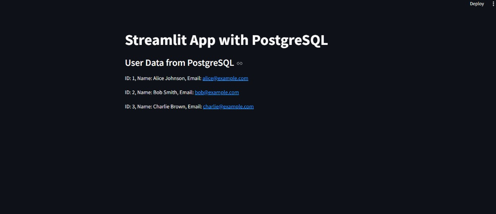

# 🚀 Streamlit App with PostgreSQL using Docker

This project demonstrates how to set up a **Streamlit** application that connects to a **PostgreSQL** database using **Docker**. You'll create a custom Docker network, launch a PostgreSQL container, insert dummy data, and deploy a Streamlit app to visualize the data.

---

## 📦 Prerequisites
- Docker installed on your system ([Get Docker](https://docs.docker.com/get-docker/))
- Basic knowledge of Docker, PostgreSQL, and Python

---

## 🛠️ Project Structure

```bash
.
├── Dockerfile      # Streamlit App Dockerfile
├── stream.py       # Streamlit application
└── README.md
```

---

## 🛠️ Step 1: Create a Docker Network
Create a custom Docker network for seamless communication between containers.

```bash
docker network create --driver bridge my_custom_network
```

---

## 🛠️ Step 2: Start PostgreSQL Container
Launch a PostgreSQL container with environment variables for credentials.

```bash
docker run -d \
  --name my_postgres \
  --network my_custom_network \
  -e POSTGRES_USER=admin \
  -e POSTGRES_PASSWORD=adminpassword \
  -e POSTGRES_DB=mydb \
  -p 5432:5432 \
  postgres
```

---

## 🛠️ Step 3: Insert Dummy Data
Access the PostgreSQL CLI to create a table and add sample data.

```bash
docker exec -it my_postgres psql -U admin -d mydb
```

Run the following SQL commands:

```sql
CREATE TABLE users (
    id SERIAL PRIMARY KEY,
    name VARCHAR(100),
    email VARCHAR(100) UNIQUE
);

INSERT INTO users (name, email) VALUES
('Alice Johnson', 'alice@example.com'),
('Bob Smith', 'bob@example.com'),
('Charlie Brown', 'charlie@example.com');

SELECT * FROM users;
```
Exit using `\q`.

---

## 🛠️ Step 4: Create Streamlit App
Create a file named `stream.py` with this content:

```python
import streamlit as st
import psycopg2

def get_db_connection():
    conn = psycopg2.connect(
        dbname="mydb",
        user="admin",
        password="adminpassword",
        host="my_postgres",
        port="5432"
    )
    return conn

st.title("🌟 Streamlit App with PostgreSQL")

try:
    conn = get_db_connection()
    cur = conn.cursor()

    cur.execute("SELECT * FROM users;")
    rows = cur.fetchall()

    st.write("### 📊 User Data from PostgreSQL")
    for row in rows:
        st.write(f"**ID:** {row[0]} | **Name:** {row[1]} | **Email:** {row[2]}")

    cur.close()
    conn.close()
except Exception as e:
    st.error(f"Error: {e}")
```

---

## 🛠️ Step 5: Dockerfile for Streamlit
Create a `Dockerfile` for your Streamlit app:

```dockerfile
FROM python:3.9
WORKDIR /app
COPY . .
RUN pip install --no-cache-dir streamlit psycopg2
EXPOSE 8501
CMD ["streamlit", "run", "stream.py", "--server.port=8501", "--server.address=0.0.0.0"]
```

---

## 🛠️ Step 6: Build and Run the Streamlit App
### 🔨 Build Docker Image
```bash
docker build -t my_streamlit_app .
```

### 🚀 Run Streamlit Container
```bash
docker run -d \
  --name streamlit_app \
  --network my_custom_network \
  -p 8501:8501 \
  my_streamlit_app
```

---

## 🧑‍💻 View the Application
- Open your browser and navigate to: [http://localhost:8501](http://localhost:8501)
- You should see the Streamlit app displaying user data from PostgreSQL.

---

## ✅ Expected Result



---

## 🧹 Cleanup
To stop and remove containers and network:

```bash
docker stop my_postgres streamlit_app
docker rm my_postgres streamlit_app
docker network rm my_custom_network
```

---

## 📜 License
This project is licensed under the **MIT License**. Feel free to use and modify it.

---

🚀 **Happy Coding with Docker, Streamlit, and PostgreSQL!** 🚀

