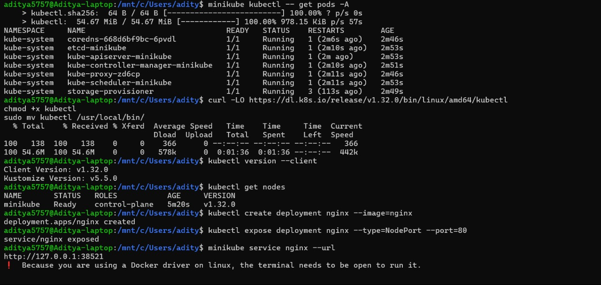

# Minikube with Docker on Linux ☸️


🚀 **Run Kubernetes Locally with Minikube & Docker** 🐳

---

## 🌟 Introduction

**Minikube** is a lightweight Kubernetes tool that allows you to run a local cluster on your machine. It's perfect for developers looking to experiment with Kubernetes without setting up cloud infrastructure. Minikube works with various drivers like Docker, VirtualBox, and KVM, making Kubernetes development easier than ever!

## 🛠️ Prerequisites

Before getting started, ensure you have the following installed:

### ✅ 1. Install Docker 🐋

Minikube runs Kubernetes inside a Docker container, so you need Docker:
- [Install Docker](https://docs.docker.com/engine/install/ubuntu/)
- Start Docker Service:
```bash
sudo systemctl start docker
sudo systemctl enable docker
```

### ✅ 2. Install Minikube 📦

Run the following command to install Minikube:
```bash
curl -LO https://storage.googleapis.com/minikube/releases/latest/minikube-linux-amd64
sudo install minikube-linux-amd64 /usr/local/bin/minikube
```

### ✅ 3. Install kubectl (Kubernetes CLI) 🔗

```bash
sudo apt install -y kubectl
```
Verify the installation:
```bash
kubectl version --client
```

---

## 🚀 Getting Started with Minikube & Docker

### ✅ Step 1: Start Minikube 🏁

Make sure Docker is running, then start Minikube using Docker as the driver:
```bash
minikube start --driver=docker
```
Check the status:
```bash
minikube status
```

---

## 🏗️ Deploying an Application

### ✅ Step 2: Deploy Nginx Web Server 🌐

#### 1️⃣ Create an Nginx Deployment
```bash
kubectl create deployment nginx --image=nginx
```

#### 2️⃣ Expose the Deployment
```bash
kubectl expose deployment nginx --type=NodePort --port=80
```

#### 3️⃣ Get the Service URL
```bash
minikube service nginx --url
```
Open the provided URL in your browser to see Nginx running! 🎉

---

## ⚙️ Managing Kubernetes Cluster

### ✅ Check Running Pods 📋
```bash
kubectl get pods
```

### ✅ Scale the Deployment 📈
Increase replicas to 3:
```bash
kubectl scale deployment nginx --replicas=3
```
Check running pods:
```bash
kubectl get pods
```

### ✅ Delete Deployment 🗑️
```bash
kubectl delete service nginx
kubectl delete deployment nginx
```

---

## ❌ Stopping and Cleaning Up Minikube

### ✅ Stop Minikube 🔻
```bash
minikube stop
```

### ✅ Delete the Cluster 🗑️
```bash
minikube delete
```
_This removes all Kubernetes resources._

---

## 🎯 Conclusion

By using **Minikube with Docker**, you can easily run Kubernetes locally without needing VirtualBox or KVM. This setup allows developers to test and experiment with Kubernetes deployments effortlessly. 🚀🔥

💡 **Next Steps:**
- Deploy custom applications in Minikube.
- Explore Kubernetes resources like ConfigMaps, Secrets, and Volumes.
- Learn how to use Helm charts for deploying applications.

💙 **Happy Kubernetes-ing!** ☸️🚢

---

## 📸 Example Output

- **Terminal Output:**


- **Browser View:**


