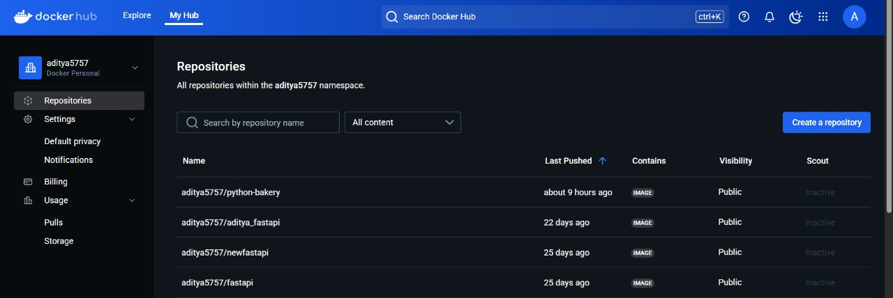
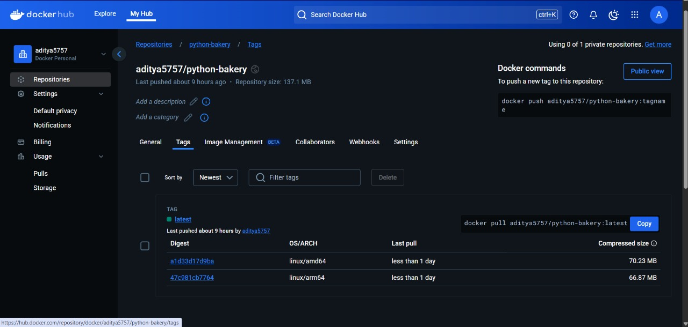

# Docker Bake: Efficient Multi-Platform Builds with Buildx 🏗️🍞

## 📌 Introduction

**Docker Bake** is a powerful tool that simplifies the process of building and managing multi-platform Docker images using **docker buildx bake**. With Docker Bake, you can define multiple build configurations using a single file and execute them in parallel, streamlining your image building process.

This guide demonstrates how to use Docker Bake to create multi-architecture images for **Python 3.9** and push them to Docker Hub.

---

## 🚀 Key Features

- **Parallel Builds**: Build multiple images simultaneously to reduce build time.
- **Multi-Platform Support**: Supports architectures like `x86_64 (AMD64)` and `ARM64`.
- **Centralized Configuration**: Manage builds using an HCL, JSON, or YAML configuration.
- **Declarative Approach**: Define build targets in a clear and maintainable format.
- **Efficient Pushing**: Push images to Docker Hub with a single command.

---

## 🛠 Prerequisites

Ensure you have the following installed:

- Docker (v20.10+)
- Docker Buildx
- Docker Hub account

Run the following commands to verify:

```bash
docker --version
docker buildx version
```

---

## 📂 Project Structure

```bash
.
├── Dockerfile
├── docker-bake.hcl
└── README.md
```

---

## 🧑‍💻 Step 1: Create Dockerfile

```Dockerfile
# Dockerfile
FROM ubuntu:20.04

RUN apt-get update && apt-get install -y \
    python3.9 python3.9-venv python3.9-dev \
    && rm -rf /var/lib/apt/lists/*

CMD ["python3"]
```

---

## 🏗 Step 2: Create docker-bake.hcl

```hcl
# docker-bake.hcl

group "default" {
    targets = ["python-bakery"]
}

target "python-bakery" {
    context    = "."
    dockerfile = "Dockerfile"
    platforms  = ["linux/amd64", "linux/arm64"]
    tags       = ["yourusername/python-bakery:latest"]
}
```

> Replace `yourusername` with your actual Docker Hub username.

---

## 🚀 Step 3: Build and Push Images

1. **Login to Docker Hub**:

   ```bash
   docker login
   ```

2. **Build and Push Images Using Docker Bake**:

   ```bash
   docker buildx bake --push
   ```

✅ This will build Python 3.9 images for both `AMD64` and `ARM64` and push them to your Docker Hub repository.

---

## 📦 Verify on Docker Hub

Once the images are pushed, visit your Docker Hub repository at:

```
https://hub.docker.com/repository/docker/aditya5757/python-bakery/general
```

You should see the multi-architecture image available under **Tags**.

---

## 📸 Result Screenshots

### Docker Hub Repository



### Multi-Architecture Tags



---

## 🚀 Conclusion

Docker Bake simplifies the process of building and pushing multi-platform images efficiently. With just a few commands, you can build images for different architectures, reducing the complexity of managing Docker images.

💡 **Next Steps:**

- Experiment with adding more build targets.
- Explore build caching for faster builds.
- Integrate Docker Bake into your CI/CD pipelines.

🎉 **Happy Building with Docker Bake!** 🐳

